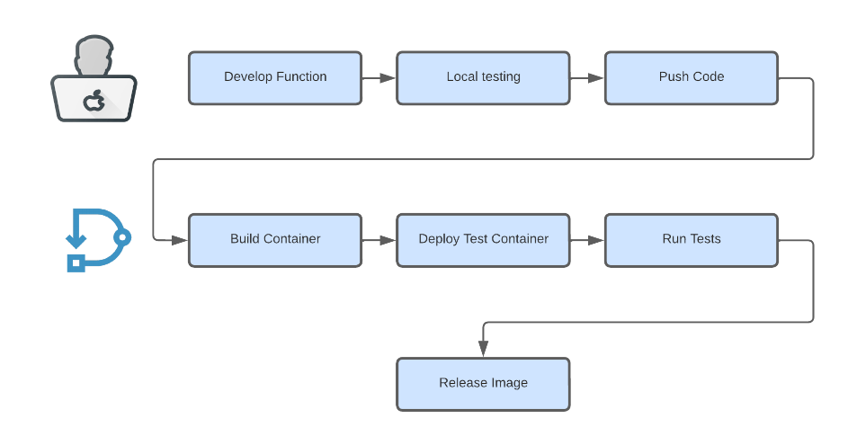

# Direktiv & Azure: How to Build and Test Software and Containers in the Cloud

In today's world, it is essential to have a process in place that allows for automated tests. Often it is desired to start with a clean environment and get it setup and configured from scratch for each test run. We had the same challenge when we prepared our new function portal where we will provide ready-to-use functions for Direktiv. We are trying to show in this blog post how we solved this for us using Azure and Direktiv. The flow we are presenting here is a very simplified version of our real process but shows the idea conceptually. It is in particular interesting because it can be used to spin up containers, virtual machines or even Kubernetes as temporary test servers and let them automatically destroy after the test runs.

But first of all, what are Direktiv functions, and how do they work? Direktiv is a container orchestration and workflow automation engine that uses [Knative](https://knative.dev/docs/) as "actions" in the flows to be executed. It's really simple to implement a function. They must listen on http port 8080 and accept JSON payloads to be compatible with Direktiv. The function may respond with JSON data when it is finished and this becomes part of the state data. The following is an example of a straightforward flow:

*Example Direktiv Flow*
```yaml
functions:
- id: get
  image: direktiv/request:v4
  type: knative-workflow
states:
- id: getter 
  type: action
  action:
    function: get
    input: 
      method: "GET"
      url: "https://jsonplaceholder.typicode.com/todos/1"
```

Let's look at the testing flow we're showcasing here. This isn't any different from other CI/CD and software development processes, as it is split into two parts. The first stage is done by the developer, who finishes the code, tests it locally (hopefully), and pushes it to a Git repository. We use Direktiv in the second stage to perform all of the CI/CD activities of building, deploying, and testing the container. It's worth noting that Direktiv, as an event-driven system, may be integrated at any time throughout the CI/CD process so the build process could stay in an esatblished CI/CD system and only the testing phase would be executed by Direktiv. 

<p align="center">

</p>

## The Service

To focus on the flow we left the example very simple. It is a simple function which returns static JSON and all the source code and flows can be found at [https://github.com/jensg-st/azure-containerapp](https://github.com/jensg-st/azure-containerapp). 


*Simple Go Function*
```go
package main

import (
	"fmt"
	"log"
	"net/http"
)

func main() {

	fmt.Println("Starting server")

	http.HandleFunc("/", func(w http.ResponseWriter, r *http.Request) {
		w.Header().Set("Content-Type", "application/json")
		fmt.Fprintf(w, "{ \"hello\": \"world\" }")
	})

	log.Fatal(http.ListenAndServe(":8080", nil))

}
```

If you want to build and run this function the [Github repository](https://github.com/jensg-st/azure-containerapp) has a `Makefile` with the targets `build-function`, which uses Docker to compile the application and create a container image, and `run-function`, which starts the container on port 9191. 

But how do we test locally? For testing our functions we are using the API testing framework [Karate](https://github.com/karatelabs/karate). It is a very powerful but simple way of testing APIs or services. It requires no coding and uses a BDD (Behavior Driven Development) syntax to describe user stories with GIVEN, WHEN and THEN. If you are looking for a testing tool have a look at Karate! But back to our test. Because it is a very simple function the test will be very simple as well. There is basically only one scenario we need to cover. 

```sh
Feature: Basic

Scenario: say-hello

	Given url karate.properties['testURL']

	And path '/'
	When method GET
	Then status 200
	And match $ ==
	"""
	{
        "hello": "world"
	}
	"""
```

This test simply does a request to `requestURL`, a variable defined at runtime and we are expecting a 200 HTTP code with a certain payload as response. There is another make target `run-test` to execute the test against a local running function. If you start an instance with `make run-function` you can use `make test-function` to execute the test. This test target basically just starts a Karate Docker image and passes the test and test URL into the container. The test should return successfully with one passed scenario.

```sh
docker run --network=host -v `pwd`/service/tests/:/tests direktiv/karate java -DtestURL=http://localhost:9191 -jar /karate.jar /tests/karate.feature ${*:1}
```

## The Flow


## Putting it all together


